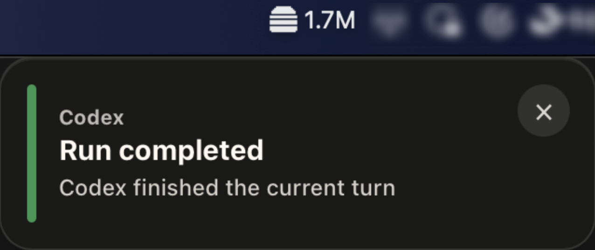
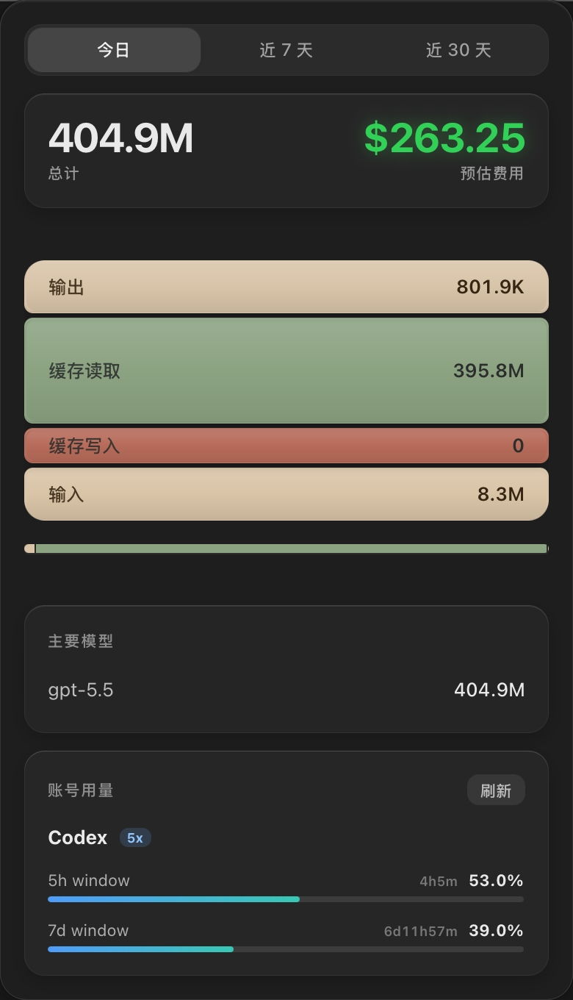
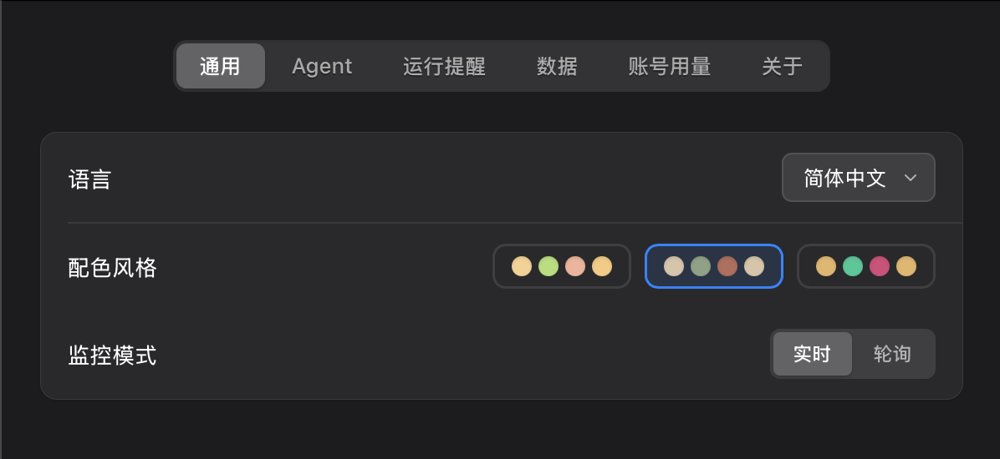

<div align="center">
    <h1>TokenBurger 🍔</h1>
    <p><strong>菜单栏 AI Token 消耗监控工具</strong></p>
    <p>
        实时监控本地各类 AI Coding Agent（Claude Code、Codex、OpenCode 等）的 Token 消耗，
        看看你的汉堡什么规格 (๑╹ڡ╹) 🍔
    </p>
    <p>
        <a href="https://github.com/zreo0/token-burger/releases">
            
        </a>
        
        
        
        <a href="./LICENSE">
            
        </a>
    </p>
</div>

<p align="center">
    
</p>

## 为什么会有它

日常经常使用 Claude Code、Codex、OpenCode 等多个工具的时候， Token 消耗是散落在各自的本地日志里。TokenBurger 把这些记录整理成菜单栏里的实时视图，让你能快速看到今天烧了多少、缓存是否健康、主要模型是谁，以及运行状态的提醒。让你感受到时刻跳动的 Token 数字，做点有意思的事儿。

所有统计数据都保存在本地 SQLite 数据库中，TokenBurger 不收集、上传或共享你的任何数据。

## 功能特性

- **实时监控**：在菜单栏统计今天的 Token 总计，看看今天烧了多少。同时也可以展示账号的订阅额度使用情况。
- **分层展示**：按输入、缓存写入、缓存读取、输出拆分 Token，快速看清汉堡里都是什么料。
- **模型与 Agent 统计**：按 Agent 和模型聚合用量，定位主要消耗来源。
- **多 Agent 支持**：开箱支持主流 AI Coding Agent，后续可继续扩展更多 Agent。
- **账号用量视图**：可查看部分账号的额度窗口与使用比例，适合日常盯量。
- **运行提醒**：手动开启后，在需要你关注的时候轻量弹出提示，例如 Codex 等待权限或当前轮次结束。
- **本地优先**：日志解析、汇总缓存和历史统计都落在本机 SQLite，隐私更可控。

## 截图

| 菜单栏监控  | 运行提醒 |
| --- | --- |
|  |  |

| 用量总览 | 设置 |
| --- | --- |
|  |  |

## 当前支持

| Agent | 数据源 | Token 统计 | 运行提醒 |
| --- | --- | --- | --- |
| Claude Code | `~/.claude/projects/**/*.jsonl` | 输入、缓存写入、缓存读取、输出、模型 | 暂无 |
| Codex | `~/.codex/sessions/**/*.jsonl` | 输入、缓存读取、输出、模型 | 权限等待、轮次完成、轮次停止 |
| OpenCode | SQLite message 数据库，兼容旧版 JSON | 输入、缓存、输出、模型 | 轮次完成 |
| Gemini CLI | `~/.gemini/tmp/*/chats/*.json` | 输入、输出、模型 | 暂无 |

运行提醒默认关闭，可以在设置里的「运行提醒」页签手动启用。它只是轻量提示，不会代替你处理权限，也不会对 Agent 执行任何操作。

## 安装

从 [GitHub Releases](https://github.com/zreo0/token-burger/releases) 下载对应平台的预编译安装包，或从源码构建。

## 从源码运行

### 前置依赖

- [Rust](https://rustup.rs/) >= 1.77
- [Node.js](https://nodejs.org/) >= 20
- Tauri CLI v2（可选）：项目已通过 `@tauri-apps/cli` 提供本地 CLI

### 安装与运行

```bash
# 安装前端依赖
npm install

# 开发模式（同时启动前端和 Tauri）
npm run tauri:dev

# 生产构建
npm run tauri -- build
```

## 开发命令速查

| 命令 | 说明 |
| --- | --- |
| `npm run dev` | 启动 Vite 开发服务器 |
| `npm run tauri:dev` | 启动 Tauri 开发模式 |
| `npm run build` | 前端类型检查与生产构建 |
| `npm run tauri -- build` | Tauri 生产构建并生成安装包 |
| `npm run lint` | ESLint 检查 |
| `npm run lint:fix` | ESLint 自动修复 |
| `npm test` | 运行前端测试（vitest） |
| `cd src-tauri && cargo test` | 运行 Rust 测试 |

## 项目结构

```text
token-burger/
├── src/                    # 前端（React + TypeScript）
│   ├── components/         # 通用组件
│   ├── hooks/              # 自定义 Hooks
│   ├── i18n/               # 多语言文案
│   ├── pages/              # Popup / Settings / BehaviorTip
│   ├── types/              # 类型定义
│   ├── App.tsx             # 路由入口
│   └── main.tsx            # React 入口
├── src-tauri/              # Rust 后端
│   ├── src/
│   │   ├── adapters/       # Agent 数据源、Token 解析、行为解析
│   │   ├── account_usage/  # 账号用量 Provider
│   │   ├── behavior/       # 运行提醒事件与提示窗口
│   │   ├── db/             # SQLite 数据库
│   │   ├── watcher/        # 文件与 SQLite 监听
│   │   ├── lib.rs          # Tauri 初始化
│   │   └── main.rs         # 应用入口
│   ├── Cargo.toml
│   └── tauri.conf.json
├── docs/images/            # README 截图
├── package.json
├── vite.config.ts
└── eslint.config.js
```

## 架构概览

TokenBurger 的后端以 Agent 监听管线为基础：每个 Agent 先声明自己的数据源，然后同一批新增数据会分别交给 Token 解析器和行为解析器消费。这样 Token 统计和运行提醒共用底层监听，不需要重复扫描同一份日志。

前端通过 Tauri command 拉取汇总数据，并通过事件驱动更新菜单栏弹窗、设置页和运行提醒窗口。

## 讨论与交流

欢迎在 [GitHub Issues](https://github.com/zreo0/token-burger/issues)、[LINUX DO](https://linux.do) 社区讨论功能需求、使用反馈以及 Bug 报告。

## 许可

[MIT License](./LICENSE)
