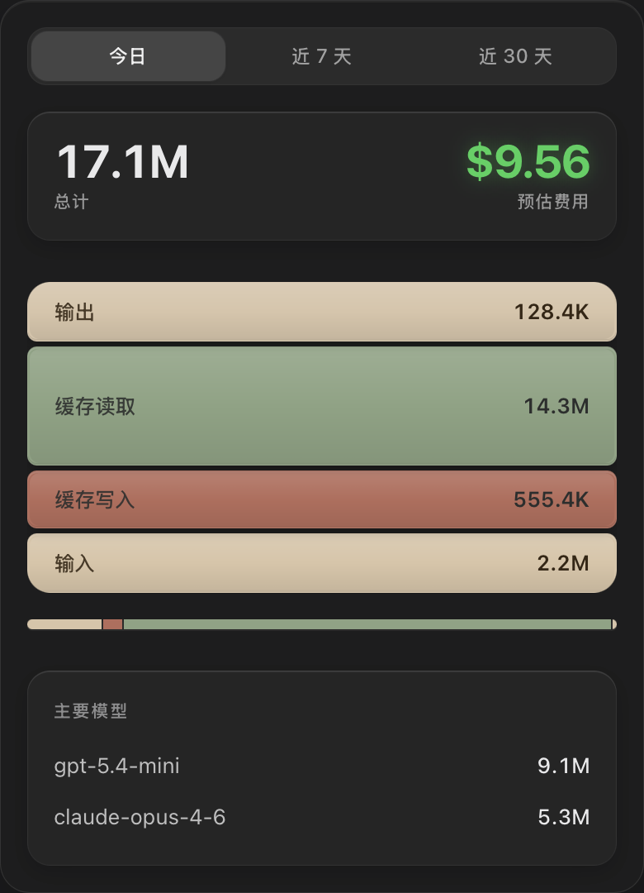

# TokenBurger 🍔

菜单栏 AI Token 消耗监控工具。实时监控本地各类 AI Coding Agent（Claude Code、Codex、OpenCode 等）的 Token 消耗，看看你的汉堡什么规格 (๑╹ڡ╹) 🍔

功能特性:
1. 实时监控，你可以在菜单栏统计今天的 Token 总计，看看今天烧了多少！
2. 简要的分层展示，看看你的汉堡里面都是什么料，今天的缓存还健康吗？
3. 支持多种 Agent，开箱即用支持主流 AI Coding Agent，未来还会持续增加支持更多 Agent。




# 安装

通过 github release 下载预编译的安装包，或从源码构建。

# 开发

## 前置依赖

- [Rust](https://rustup.rs/) >= 1.77
- [Node.js](https://nodejs.org/) >= 20
- Tauri CLI v2：`cargo install tauri-cli --version "^2"`

## 安装与运行

```bash
# 安装前端依赖
npm install

# 开发模式（同时启动前端和 Tauri）
npm run tauri dev

# 生产构建
npm run tauri build
```

## 项目结构

```
token-burger/
├── src/                    # 前端 (React + TypeScript)
│   ├── components/         # 通用组件
│   ├── hooks/              # 自定义 Hooks
│   ├── pages/              # 页面（Popup / Setting）
│   ├── types/              # 类型定义
│   ├── App.tsx             # 路由入口
│   └── main.tsx            # React 入口
├── src-tauri/              # Rust 后端
│   ├── src/
│   │   ├── main.rs         # 应用入口
│   │   ├── lib.rs          # Tauri 初始化
│   │   ├── db/             # SQLite 数据库
│   │   ├── watcher/        # 文件监听
│   │   └── adapters/       # Agent 适配器
│   ├── Cargo.toml
│   └── tauri.conf.json
├── package.json
├── vite.config.ts
└── eslint.config.js
```

## 开发命令速查

| 命令 | 说明 |
|------|------|
| `npm run dev` | 启动 Vite 开发服务器 |
| `npm run build` | 前端生产构建 |
| `npm run lint` | ESLint 检查 |
| `npm run lint:fix` | ESLint 自动修复 |
| `npm run test` | 运行前端测试 (vitest) |
| `cd src-tauri && cargo test` | 运行 Rust 测试 |
| `npm run tauri dev` | Tauri 开发模式 |
| `npm run tauri build` | Tauri 生产构建 |
